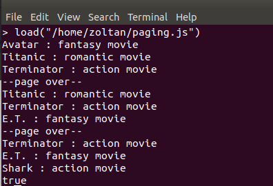

Cursor függvényeinek gyakorlása videoStore adatbázissal

1. Használd a videoStore adatbázist (az első gyakorló feladatokból)!  
`use videoStore`

2. Számold meg, hány akció- és romantikus filmed van összesen!  
`db.movies.find({category: {$in: ["action","romantic"]}}).count()`
3. Kérdezd le a „FANTASY” filmek nevét és a kategóriáját. Mentsd le a listát (Cursor-t) egy változóba!  
`var myList = db.movies.find({category: "fantasy"},{_id:0,title:1,category:1})`
4. Írj egy ciklust, amely végigiterál a listán, és kiírja filmek a nevét és kategóriáját => példa: Végtelen történet: FANTASY (tipp: print() függvénnyel lehet kiíratni az értékeket Mongo shell-ben)!  
`myList.forEach(movie => print(`${movie.title}: ${movie.category}`))`

5. Készíts egy lekérdezést, amely fordított sorrendben (_id) adja vissza csak a filmcímeket!  
`db.movies.find({},{_id:0,title:1}).sort({_id:-1})`  

6. Készíts egy lekérdezést, amely első lépésként a kategóriák szerint rakja sorba az elemeket, majd utána a megjelenés éve szerint fordítva sorolja fel! A lekérdezés csak a film címét, kategóriáját és megjelenési évét adja vissza.  
`db.movies.find({},{_id:0,title:1,category:1,releaseYear:1}).sort({category:1, releaseYear:-1})`  

7. Kérdezd le az ACTION kategóriából a legutóbb készült filmet (szigorúan a query-nek kell megkeresnie, manuálisan kinézni a DB-ből nem ér)!  
`db.movies.find({category: "action"}).sort({releaseYear:-1}).limit(1)`  

8. Kérdezd le az adatbázisból a két legrégebben készült film címét és gyártási évét!  
`db.movies.find({},{_id:0,title:1,releaseYear:1}).sort({releaseYear:1}).limit(2)`  

9. Kérdezd le a ROMANTIC kategóriából a második legfrissebben megjelent film nevét és megjelenési évét!  
`db.movies.find({category: "romantic"},{_id:0,title:1,releaseYear:1}).sort({releaseYear:-1}).skip(1).limit(1)`  

10. Készíts egy scriptet egy javaScript fájlban! A script feladata, hogy egyetlen függvényben lekérdezze a mozifilmek számát kimentve egy változóba, majd ennek segítségével egy ciklus keretében 3-asával lapozva írja ki a konzolra a filmek címeit és kategóriáit (kisbetűvel a kategóriát) a következő módon =>
- pl.: „Terminator : action movie”
- Minden egyes oldal alján jelenjen meg a szöveg: --page over--!
- Segítségül egy lehetséges eredmény:  

`load("C:\\Training360\\2_FullStackAPI\\str-hgk-sajat-munka\\mongo-feladat-03\\paging.js")`
