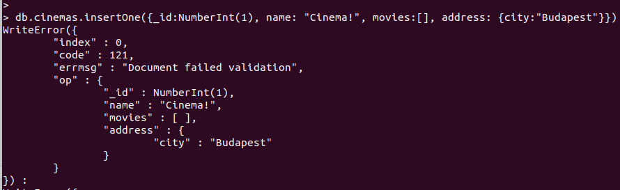
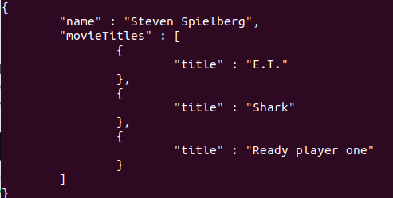

**Validátorok létrehozásának gyakorlása**

1. Használjuk a videoStore adatbázist!  
`use videoStore`

2. Hozzunk létre benne egy új „cinemas” listát, amely a következő kikötésekkel rendelkezik:
- _id: kötelező megadni és csak egész számokból (integer) állhat
- 'name' mező: string lehet, kötelező megadni. Csak számokból, betűkből (angol) és szóközből állhat
- 'movies' mező: 'array' lehet és kötelező megadni
- 'address' mező: objektum lehet és kötelező megadni (az objektumban majd elég egy „city” mezővel játszani)  
`db.createCollection("cinemas", {
	validator: {
		$jsonSchema: {
			required: ["_id","name","movies","address"],
			properties: {
				_id: { bsonType: "int" },
				name: { bsonType: "string", pattern: "^[a-zA-Z0-9 ]+$"},
				movies: { bsonType: "array" },
				address: {	bsonType: "object", 
							required: ["city"],
							properties: {
								city: { bsonType: "string" }
							}
				}
			}
		}
	}
})`

3. Végezzünk el pár próbamentést az alábbi adatokkal; a lényeg, hogy egyik adatnak sem szabad(na) elmentésre kerülnie:
- _id:NumberInt(1), name: "Cinema!", movies:[], address: {city:"Budapest"}  
`db.cinemas.save({_id:NumberInt(1), name: "Cinema!", movies:[], address: {city:"Budapest"}})`
- name: "Cinema", movies:[], address: {city:"Budapest"},
- _id:NumberInt(1), name: "Cinema", movies: "Titanic", address: {city:"Budapest"},
- _id:NumberInt(1), name:"Cinema", address: {city:"Budapest"},
- _id:NumberInt(1), name: "Cinema", movies:[], address: "Budapest",
- _id:NumberInt(1), name:"Cinema", movies:[]  
`db.cinemas.save({_id:NumberInt(1), name: "Cinema!", movies:[], address: {city:"Budapest"}})  
db.cinemas.save({name: "Cinema", movies:[], address: {city:"Budapest"}})  
db.cinemas.save({_id:NumberInt(1), name: "Cinema", movies: "Titanic", address: {city:"Budapest"}})  
db.cinemas.save({_id:NumberInt(1), name:"Cinema", address: {city:"Budapest"}})
db.cinemas.save({_id:NumberInt(1), name: "Cinema", movies:[], address: "Budapest"})
db.cinemas.save({_id:NumberInt(1), name:"Cinema", movies:[]})
db.cinemas.save({_id:NumberInt(1), name:"Cinema", movies:["Titanic"], address: {street:"Budapest"}})
`

Egyik sem működhet a validátor használata során:  
`WriteResult({
        "nInserted" : 0,
        "writeError" : {
                "code" : 121,
                "errmsg" : "Document failed validation"
        }
})`

4. Most megfelelő adatokkal mentsünk el 3 mozi dokumentumot:
- pl.: _id: NumberInt(1), name: "Cinema Mompark", movies:[], address: {city:"Budapest"}...
`> db.cinemas.save({_id:NumberInt(1), name:"Cinema", movies:[], address: {city:"Budapest"}})`
- Adjunk hozzá az egyik dokumentum „movies” listájához egy tetszőleges mozifilm id-t (amely létezik a „movies” collection-ben)!  
`db.cinemas.updateOne({_id:1},{$push: {movies: ObjectId("60dc66c79db2e529f065f9d4")}})`
5. Ellenőrizzük, hogy amikor update-elni akarjuk a mozi egy-egy sorát, nem engedi a validátorunk:
- Próbáljuk átírni a mozi nevét, hogy egy speciális karaktert tartalmazzon! Cinema Mompark => %Cinema MomPark  
`db.cinemas.updateOne({_id:1},{$set: {name: "%Cinema MomPark"}})`

- Frissítsük az egyik dokumentumot úgy, hogy a movies listát próbáljuk lecserélni egy sima filmcímre!
`db.cinemas.updateOne({_id:1},{$set: {movies: "Titanic"}})`

- Próbáljuk meg eltávolítani az "address" mezőt!  
`db.cinemas.updateOne({_id:1},{$unset: {address: ""}})`

- Próbáljuk eltávolítani a "movies" mezőt!  
`db.cinemas.updateOne({_id:1},{$unset: {movies: ""}})`

Egyik sem működhet a validátor használata során.

**Listák közötti kapcsolatok, aggregáció gyakorlása, Embed vs. Referencing**

_**Ha egy objektum (dokumentum) egy másik dokumentum egyik mezőjében van, akkor beszélhetünk „embed”, beágyazott dokumentumról.**_

Most forduljunk vissza a videoStore adatbázisunkhoz:

1. Ha még nem tettük meg, a cinema listánk rendelkezzen 3 cinema dokumentummal, és minden cinema dokumentum „játsszon” legalább 3 különböző filmet => adjunk hozzá legalább 3 cinema dokumentum egyes movies listájához 3 db "_id" értéket a movies listából!  
`db.cinemas.insertMany([
{_id:NumberInt(1), name: "Cinema Fantasy", movies: [ObjectId("60dc66c79db2e529f065f9d4"),ObjectId("60dc66c79db2e529f065f9d5"),ObjectId("60dc66c79db2e529f065f9d6")], address: {city:"Budapest"}},
{_id:NumberInt(2), name: "Cinema Action", movies: [ObjectId("60dc66c79db2e529f065f9d7"),ObjectId("60dc66c79db2e529f065f9d8"),ObjectId("60dc66c79db2e529f065f9d9")], address: {city:"Budapest"}},
{_id:NumberInt(3), name: "Cinema Romantic", movies: [ObjectId("60dc66c79db2e529f065f9da"),ObjectId("60dc66c79db2e529f065f9db"),ObjectId("60dc66c79db2e529f065f9dc")], address: {city:"Budapest"}}])
`

2. Kérdezzük le, hogy az első helyen lévő mozink milyen filmeket játszik, jelenjen meg minden film tulajdonsága!  
`db.cinemas.aggregate([
{$match: {_id:1}},
{$lookup: {
	from: "movies",
	localField: "movies",
	foreignField: "_id",
	as: "movies"
}}
]).pretty()`
3. Ismételjük meg a fenti lekérdezést úgy, hogy csak a játszott film listája, adatai jelenjenek meg (tipp: „project” operator)!  
`db.cinemas.aggregate([
{$match: {_id:1}},
{$lookup: {
	from: "movies",
	localField: "movies",
	foreignField: "_id",
	as: "movies"
}},
{$project: {_id:0, movies:1}}
]).pretty()`
4. Ha még nem tettük meg, készítsünk el a videoStore-ban egy directors listát (a 2. feladat leírása alapján), és minden rendezőhöz rendeljünk 2-3 db filmet a „movies” mezőjükhöz.

5. Kérdezzük le az egyik rendező által rendezett filmek adatait!  
`db.directors.aggregate([
{$match: {_id:1}},
{$lookup: {
	from: "movies",
	localField: "movies",
	foreignField: "_id",
	as: "movies"
}},
{$project: {_id:0, movies:1}}
]).pretty()`

6. Kérdezzük le egy másik rendező filmjeit úgy, hogy csak a rendező neve és a filmek „title”-jei, vagyis címei jelennek meg (tipp: $project operátor)!  
`db.directors.aggregate([ {$match: {_id:2}}, {$lookup: { from: "movies", localField: "movies", foreignField: "_id", as: "movieTitles" }}, {$project: {_id:0, name:1, "movieTitles.title":1}} ]).pretty()`

7. Adj pár szavazatot egy-egy filmre ("ratings"), ha még nem tetted meg. Írj egy lekérdezést az aggregáció segítségével, amely visszaadja annak a filmnek a címét, amely a legjobb átlagszavazattal rendelkezik! Két mezőt adjon vissza: "title" és egy új mező: "rateAvg" => pl.: { "title" : "E.T.", "rateAvg" : 4.5 }. Csak aggregációt használj, Cursor metódusok használata nélkül!  
`db.movies.aggregate([
{$set: { rateAvg: {$avg: "$ratings"}}},
{$project: {_id:0, title:1, rateAvg:1}},
{$sort: {rateAvg:-1}},
{$limit: 1}
])`